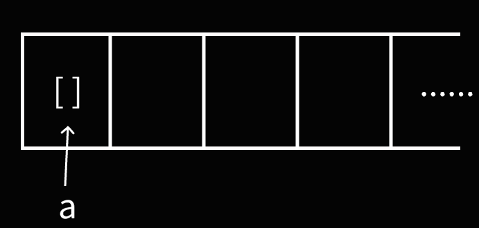
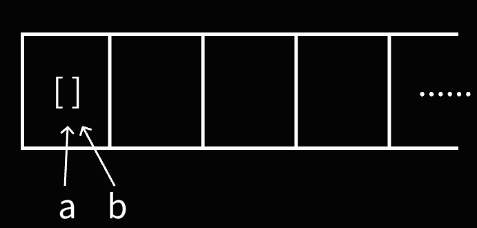
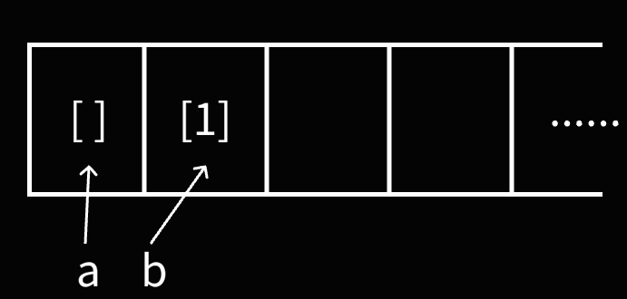
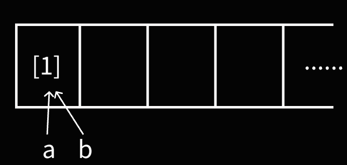

# Python中的赋值与传参，你真的了解吗？
## 导语
许多Python新手（尤其是将Python作为第一门编程语言来学习的）经常会不清楚Python中的赋值与传参的一些细枝末节的问题。
文本尝试让读者清楚以下问题的答案：

+ Python中的赋值是指什么？
+ Python是如何进行参数传递的？
+ Python是如何处理默认参数的？
+ Python中哪些对象是同一个？

!!! note "阅读建议"
    阅读难度：较易

## 测试环节
在开始本篇文章前，让我们先来做个小测试。

**测试1**：以下代码的输出是什么？
```Python
lst: list[int] = []

def f(x: list[int]):
    x.append(1)
    x = [1, 2]

f(lst)
print(lst)
```

**测试2**：使用以下代码给`Player`赋予初始默认的道具`sword`有没有潜在bug？
```Python
class Player:
    def __init__(self, items: list[str] = ['sword']):
        self.items = items
```

**测试3**：使用以下代码实现“构建一个有`N`个`Node`的列表”有没有潜在bug？
```Python
class Node:
    def __init__(self, value: int):
        self.value = value

N = 10
nodes: list[Node] = [Node(0)] * N
```

**测试4**：使用以下代码实现“复制一个`Node`”有没有潜在bug？
```Python
class Node:
    def __init__(self, data: dict):
        self.data = data

    def clone(self) -> 'Node':
        return Node(self.data)
```

## 测试答案
**测试1**：`[1]`

**测试2**：有。例如：
```Python
class Player:
    def __init__(self, items: list[str] = ['sword']):
        self.items = items
    
p1 = Player()
p2 = Player()
p2.items.append("apple")  # 预计只改变p2，但p1也改变了
print(p1.items, p2.items)
```
输出：
```Console
['sword', 'apple'] ['sword', 'apple']
```

**测试3**：有。例如：
```Python
class Node:
    def __init__(self, value: int):
        self.value = value
    
    def __repr__(self) -> str:
        return f"Node({self.value})"

N = 10
nodes: list[Node] = [Node(0)] * N
print(nodes)
nodes[0].value = 1  # 预计只会改变第0个node，但是所有node都改变了
print(nodes)
```
输出：
```Console
[Node(0), Node(0), Node(0), Node(0), Node(0), Node(0), Node(0), Node(0), Node(0), Node(0)]
[Node(1), Node(1), Node(1), Node(1), Node(1), Node(1), Node(1), Node(1), Node(1), Node(1)]
```

**测试4**：有。例如：
```Python
class Node:
    def __init__(self, data: dict):
        self.data = data

    def clone(self) -> 'Node':
        return Node(self.data)
    
node1 = Node({"A": 1})
node2 = node1.clone()
print(node1.data, node2.data)
node2.data["B"] = 2  # 预计只改变node2，但是node1也改变了
print(node1.data, node2.data)
```
输出：
```Console
{'A': 1} {'A': 1}
{'A': 1, 'B': 2} {'A': 1, 'B': 2}
```

!!! note "以上代码运行结果均在Python 3.12中通过实际运行进行了验证"

## 解析
以上问题你是否答对了呢？如果没有，让我们一起来看看Python的赋值与传参背后发生了什么。

### 对象与变量
首先让我们区分两个基本概念：**对象（Object）**与**变量（Variable）**

Python里的**对象（Object）**是保存在计算机**内存**中的有其特定类型（以及属性与方法）的数据（注意这里说的不是“面向对象编程”中的“对象”概念）。
Python里的**变量（Variable）**是用来标识对象的名字，是贴在对象上的标签，是获取、访问、使用某个对象的方式。

让我们来看一个例子：
```Python
class SimpleClass:
    pass

SimpleClass()  # 这行代码在内存中创建了一个类型为`SimpleClass`的**对象**，但没有赋值给任何变量
a = SimpleClass()  # 这行代码在内存中创建了一个类型为`SimpleClass`的**对象**，并将该对象赋值给了**变量a**
```
通过上面的代码，相信读者已经能区分对象和变量。

### 赋值
让我们先来看两个例子：
```Python title="示例1"
a = []
b = a
b = [1]
print(a, b)
```

```Python title="示例2"
a = []
b = a
b.append(1)
print(a, b)
```

这里两段代码的输出分别是：
`[] [1]` 与 `[1] [1]`

那么，这两段代码背后发生了什么呢？

`a = []`这行代码在内存中创建了一个`[]`对象，并将其赋值给了变量`a`。在Python中，将对象赋值给变量是指**将该变量作为对象的一个指针（标签）**（有C/C++语言基础的读者理解为`PyObject*`，即指针即可）。于是，上面那行代码就相当于进行了如下操作：

先在内存中创建一个`[]`对象


将变量`a`指向`[]`对象（给`[]`对象贴上标签`a`）


`b = a`这行代码**将变量`b`指向变量`a`指向的对象**，相当于如下操作：


接下来，在第一段代码的`b = [1]`中，**创建了一个新的对象`[1]`, 并将变量`b`重新指向了这个新对象**。图示如下：

所以第一段代码，`print(a, b)`分别输出变量`a`和变量`b`对应的对象，结果为`[] [1]`

在第二段代码的`b.append(1)`中，**向变量`b`指向的列表对象中添加了一个元素`1`**，要注意的是这个操作没有改变变量`b`指向的对象，`a`与`b`仍指向同一个对象。图示如下：

这就解释了为什么看似只改变了变量`b`，但变量`a`也随之改变了。

### 赋值操作的底层实现
!!! note "阅读建议"
    建议阅读该部分的读者有一定的C/C++语言基础，对于初学者，建议跳过该部分

那么，为什么Python的赋值操作是这样的呢？这就要说到Python的底层实现（官方实现：cpython，用C语言实现的Python）了。
在cpython中，Python对象以`PyObject*`，即`PyObject`结构体的指针传递，所以有和指针相同的行为。
```C title="cpython/Python/bytecodes.c 中 STORE_NAME 字节码的C语言实现"
inst(STORE_NAME, (v -- )) {
    PyObject *name = GETITEM(FRAME_CO_NAMES, oparg);
    PyObject *ns = LOCALS();
    int err;
    if (ns == NULL) {
        _PyErr_Format(tstate, PyExc_SystemError,
                      "no locals found when storing %R", name);
        DECREF_INPUTS();
        ERROR_IF(true, error);
    }
    if (PyDict_CheckExact(ns))
        err = PyDict_SetItem(ns, name, v);
    else
        err = PyObject_SetItem(ns, name, v);
    DECREF_INPUTS();
    ERROR_IF(err, error);
}
```

如果我们将Python代码近似地“翻译”成C++代码：
```Py
a = []
b = a
b.append(1)
```

```Cpp
class PyObject {
    // ...
};

class PyIntObject : public PyObject {
    // ...
};

class PyListObject : public PyObject {
public:
    void append(PyObject* item);

    // ...
};

PyObject* a = new PyListObject();
PyObject* b = a;
b->append(new PyIntObject(1));
```